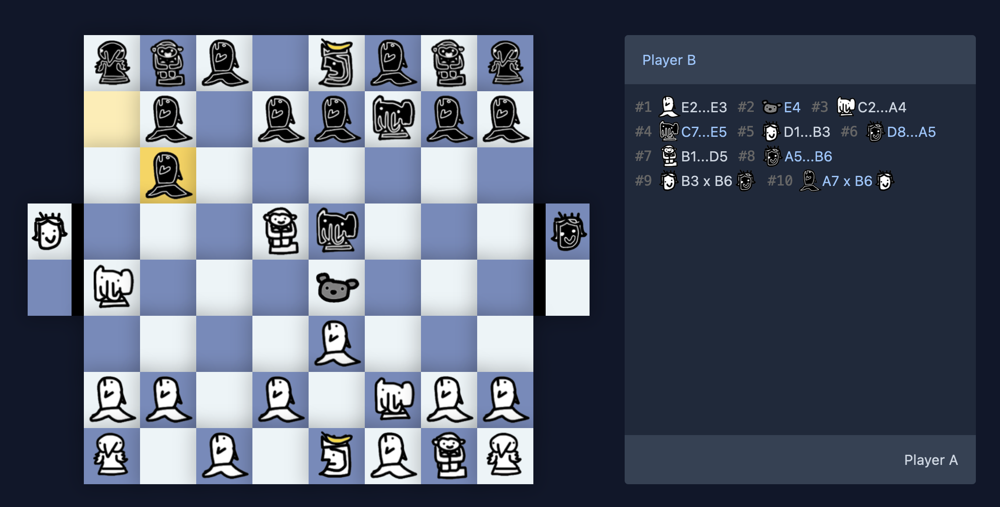

# ♟ [chess2.io](https://chess2.io)

A [chess 2 (Oats Jenkins)](https://www.youtube.com/watch?v=mcivL8u176Y) implementation using Svelte & Socket.io. It features realtime multiplayer gameplay, implements all the nitty-gritty game details and is available for free.

Play live on [chess2.io](https://chess2.io)



## 🚧 Construction

The code base is still in early development as I speedrun' most parts of the game. I'll keep pushing more organized code in the near future.


## 🎉 Features

- Realtime Games vs. Friends & Strangers
- Complete Implementation of all rules
- Game Engine for Front- & Backend JS projects

## 👩‍💻 How to setup

Clone the repository and install the dependencies for the server & frontend using `yarn` (or npm):

```shell
# in repo root
yarn install
yarn --cwd client install
```

Then start the game server:
```shell
# in repo root
yarn run dev 
```

Then start the frontend using:
```shell
# in repo root
yarn --cwd client run dev
```

That's it 🎉 Follow the instructions on your terminal to open chess 2 and start developing :).

## 💗 Contributing

Contributors are welcome to participate on this project.
Feel free to open issues and pull requests without hesitation.

## 📝 Todo

- [ ] Tensorflow AI
- [ ] Responsive Design
- [ ] Test Suite

## 🏛 License

Licensed under GNU GPL 3. View the complete license here: [LICENSE](./LICENSE)

## © Copyright

chess2 idea & original assets are (C) by [Oats Jenkins](https://www.youtube.com/watch?v=mcivL8u176Y).